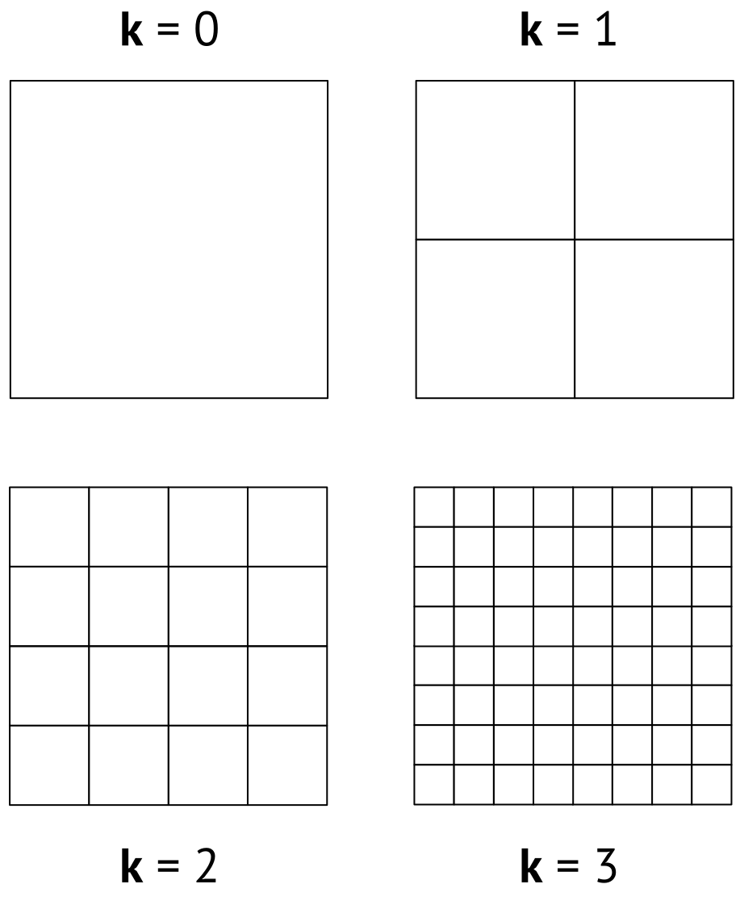

## Генерация Z-кривой и кривой Гильберта

**Задача**: разбить территорию на $N \times N$ ячеек, упорядочив их по близости.

::: columns
::: {.column width="60%"}
**Общий алгоритм**:

1.  Начать с представления области в виде одной ячейки ($k = 0$).

2.  Итерировать по $k = 1, ..., n-1$, где $n = \log_2N$

    -   разбить территорию на $2^k \times 2^k$ блоков;

    -   вычислить номера ячеек.

::: callout-tip
## Размер блока на каждой итерации

На каждой итерации каждая ячейка заменяется на 4 блока размером $2^{n-k} \times 2^{n-k}$.
:::
:::

::: {.column width="40%"}
{width="100%"}
:::
:::

## 
